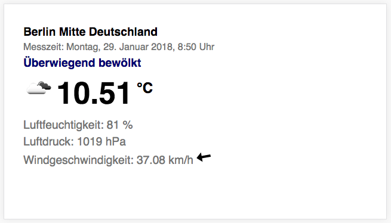

# current weather berlin
displays the current weather data for Berlin Germany



## API key
Berlin Weather uses the weather API from [OpenWeatherMap](https://openweathermap.org/).
To get to work this application you need an API key. To get access to weather data you have to sign up on OpenWeatherMap.

1. create a new account on OpenWeatherMap: <https://openweathermap.org/appid>


2. assign your API key to the appId constant in the current-weather.js
```
const appId = '{your-api-key}';
```
